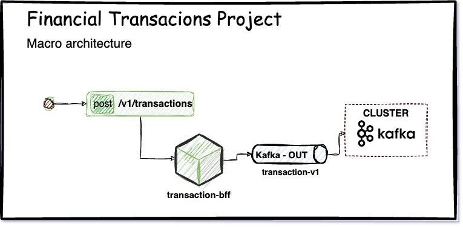

# Project Structure



##

## Kafka

Apache Kafka has emerged as an efficient alternative for large-scale data publishing and consumption, going beyond a
mere
messaging tool. It defines and enables distributed systems to communicate through event exchange.

All message communication is managed by a Kafka cluster, a tool that directs and organizes data flows, saving,
retrieving,
and processing them. Nowadays, it is both common and desirable for our applications to communicate asynchronously.
We aim for greater interoperability in our services, allowing them to communicate and exchange information
independently.

As such, publishing and consuming events in a data channel is the most appealing approach for this concept.

To learn more about data streaming, visit: [kafka documentation](https://kafka.apache.org/intro#intro_streaming)

### But what are events?

Events are actions, the act of doing something, requesting something, informing something, and so on. Events are data
interactions
that trigger a response, and every response has an action. Kafka plays the role of orchestrating and handling events.

A unique feature of Kafka is that it manages its events through key and value pairs. Each published event and its
information have a specified format, which Kafka uses to perform data serialization and deserialization.

### Topics

All events published to Kafka are directed to a structure we call topics. Topics store the data, which we can refer to
as
ordered and immutable logs.

Topics are created to maintain records of our stored data; every published information (event) is sent to a topic.
Generally, topics are created to abstract our business rules. Using the example we are adopting about financial
transactions,
consider an event where we create a message for sending a PIX (a Brazilian instant payment system). In this event, there
is always a body (data structure) containing user information and inputs required for PIX processing.

This message will be sent to a respective topic, which at some point will be collected (consumed) and processed.


As depicted in the above image, each Kafka event is treated as a log entry. Each topic can be created and configured to
store data indefinitely or until it reaches a specific size, akin to a database.

The simplicity of the log and the immutability of its content are pivotal to Kafka's success as a critical component in
our project infrastructure. In this scenario, our financial transaction would be queued for consumption without any
alteration to its information, thereby preserving its integrity.

### Producer Kafka Explanation

To begin using the Kafka framework, we need to establish some foundational policies. We will define the format for
working with events and configure how our Kafka producer and consumer will publish/write messages to the topic.

In the project configuration file "application.yml," the serialization policies are defined in JSON format.

Example:

```groovy
  kafka:
producer:
bootstrap - servers : 0.0 .0 .0 : 9092
key - serializer : org.apache.kafka.common.serialization.StringSerializer
value - serializer : org.springframework.kafka.support.serializer.JsonSerializer
properties:
acks:
all
retries: 10
retry.backoff.ms : 1000

```

For the topic to be created, there is a configuration class that instantiates the topic with its basic settings such as
name, replica count, and so on.

```java

@Configuration
@Profile("dev")
public class AutoCreateConfig {

    @Value("${topic.transaction.name}")
    public String topic;

    @Value("${topic.transaction.partitions}")
    public Integer partitions;

    @Value("${topic.transaction.replicas}")
    public Integer replicas;

    @Bean
    public NewTopic transactionTopicEvent() {
        return TopicBuilder
                .name(topic)
                .partitions(partitions)
                .replicas(replicas)
                .build();
    }
}
```

In our configuration file, it was defined that data transport will be in JSON format. With this parameterization, we
should
implement the Kafka mechanism responsible for sending messages to the topic, the Kafka Template.
In the following example, we have the creation of the template where a Java object is sent to the topic in JSON format.

```java
public class TransactionProducerV1 {

    private KafkaTemplate<String, TransactionEventV1> kafkaTemplate;

    @Value("${topic.transaction.name}")
    public String topic;

    public void send(TransactionEventV1 transaction) {

        var mensagem = MessageBuilder.withPayload(transaction)
                .setHeader(TOPIC, topic)
                .setHeader(KEY, key)
                .build();

        kafkaTemplate.send(mensagem);
    }
}

```

## Docker

To start the project you need to run the docker-compose file, it is in the dev folder at the root of the project.
Inside the folder you will find the file: [docker-compose-m1-single-broker
](./dev/docker-compose-m1-single-broker.yml).

Run the following command in the terminal to load kafka locally:

```bash
docker-compose -f docker-compose-m1-single-broker.yml up -d 
```

To check if it is running:

```bash
$ docker ps -a
CONTAINER ID   IMAGE                             COMMAND                  CREATED          STATUS          PORTS                                              NAMES
64cf60b6442f   confluentinc/cp-kafka:7.3.2       "/etc/confluent/dock…"   12 seconds ago   Up 10 seconds   0.0.0.0:9092->9092/tcp, 0.0.0.0:29092->29092/tcp   kafka1
e87c9e694a8e   confluentinc/cp-zookeeper:7.3.2   "/etc/confluent/dock…"   14 seconds ago   Up 11 seconds   2888/tcp, 0.0.0.0:2181->2181/tcp, 3888/tcp         zoo1
```

**Interact with our container:** Now let's publish an event, for that we will have to enter the container
```bash
docker exec -it kafka1 bash 
```

Folders containing Kafka files are inside the directoryopb -> bitnami -> kafka -> bin:
```bash
/opt/bitnami/kafka/bin ou /opt/bin
```

After following the path of the folders, we will see all the kafka config files
```bash
!@1ba279a1703c:/opt/bitnami/kafka/bin$ ls
connect-distributed.sh        kafka-configs.sh             kafka-delete-records.sh   kafka-mirror-maker.sh                kafka-server-start.sh               kafka-verifiable-producer.sh     zookeeper-shell.sh
connect-mirror-maker.sh       kafka-console-consumer.sh    kafka-dump-log.sh         kafka-preferred-replica-election.sh  kafka-server-stop.sh                trogdor.sh
connect-standalone.sh         kafka-console-producer.sh    kafka-features.sh         kafka-producer-perf-test.sh          kafka-storage.sh                    windows
kafka-acls.sh                 kafka-consumer-groups.sh     kafka-leader-election.sh  kafka-reassign-partitions.sh         kafka-streams-application-reset.sh  zookeeper-security-migration.sh
kafka-broker-api-versions.sh  kafka-consumer-perf-test.sh  kafka-log-dirs.sh         kafka-replica-verification.sh        kafka-topics.sh                     zookeeper-server-start.sh
kafka-cluster.sh              kafka-delegation-tokens.sh   kafka-metadata-shell.sh   kafka-run-class.sh                   kafka-verifiable-consumer.sh        zookeeper-server-stop.sh
```

### Basic commands for using Kafka

**Criate topic**
```
./kafka-topics.sh --create --topic test-topic --replication-factor 1 --partitions 4 --bootstrap-server localhost:9092
```

**Instantiate a console for the producer**
```
./kafka-console-producer.sh --broker-list localhost:9092 --topic test-topic
```

**Instantiate a console for the Consumer**

Inside the container:
```
./kafka-console-consumer.sh --bootstrap-server localhost:9092 --topic test-topic --from-beginning
./kafka-console-consumer.sh --bootstrap-server localhost:9092 --topic test-topic --group <group-name>
```

Command prompt:
```
docker exec --interactive kafka1 kafka-console-consumer --bootstrap-server kafka1:19092 --topic transaction-v1 --from-beginning
```

**List topics**
```
./kafka-topics --bootstrap-server localhost:9092 --list
```

**Delete topics**
```
./kafka-topics.sh --bootstrap-server localhost:9092 --delete --topic test-topic
```

**Check consumer groups**

Inside the container:
```
./kafka-consumer-groups.sh --bootstrap-server localhost:9092 --list
```
**Command prompt:**
```
docker exec --interactive kafka1 kafka-consumer-groups --bootstrap-server kafka1:19092 --list
```

## OpenApi
**Important links**

- https://springdoc.org/
- https://www.baeldung.com/spring-rest-openapi-documentation

